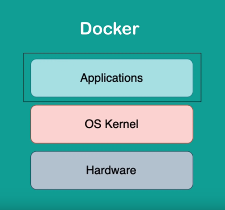
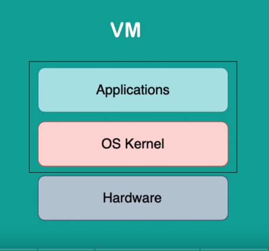

# What is a container?
- Is a way to package application with all the necessary dependencies and configurations
- Portable artifact, easily shared and moved around
- Makes development and deployment more eficient
## Where do containers live?
- In a container repository
- Private repositories
- Public repository
- <a href="hub.docker.com" target="_blank">DockerHub</a>
## Before containers:
- Need to install every dependencies in your own operational system
- High probability to errors, because there are so many steps
## After containers:
- A container is an own isolated environment, like an OS
- Package with all needed configuration
- One command to install the app
- Run 2 different versions
## Container Image
- Layers of images
- Mostly Linux Base Image, because small in size
## Pulling a container
<code>docker pull container_name:version</code>

## Running a container
<code>docker run container_name:version</code>

## Difference between <i>Image</i> and <i>Container</i>
### <i>IMAGE</i>
- It is the actual package, and artifact that can be moved around, with a lot of layers
- <b>not running</b>
### <i>CONTAINER</i>
- Actually start the application
- Container environment is created
- <b>running</b>

## See your containers
<code>docker ps</code>

## Difference between Docker and Virtual Machines
### How does an Operational System works?
  
- It has the Application layer, where your apps is built
- Also has the Kernel layer, where the communication with the Hardware happens
  
### Docker
  
- The Docker only the virtualization of the applications, and uses the same Kernel of the host - this is why it is so much lighter than VMs
- the size is so much smaller and faster too

### Virtual machines
  
- Virtual Machines, in the other hand, is the virtualization of a hole system, <i>including</i> the <b>kernel</b>
- The big advantage of VMs is that you can run any VM in any OS you want, wich is not possible with Docker

